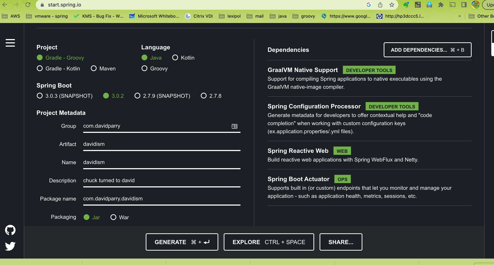

# 10 Min demo for Springboot 

## Objective show in 10 min a springboot web reactive project

### Steps taken to accomplish this project.
- https://start.spring.io/
- pick the following dependencies 
- click Generate to download the project
- mv ~/Downloads/chuck.zip ~/talk
- cd ~/talk
- tar -xzvf chuck.zip
- rm chuck.zip
- jenv local graalvm64-17.0.6
-  ./gradlew bootRun
- ./gradlew nativeCompile !! you must have a [graalvm](https://www.graalvm.org/downloads/) jdk installed and setup for this bonus step)
- ./build/native/nativeCompile/chuck (see the above need graalvm )

